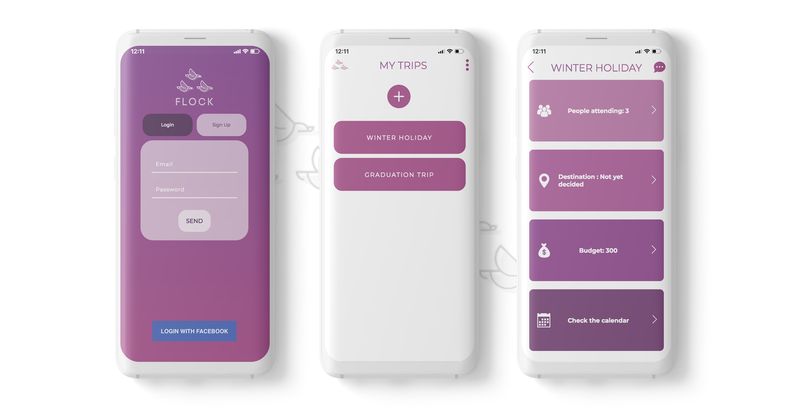
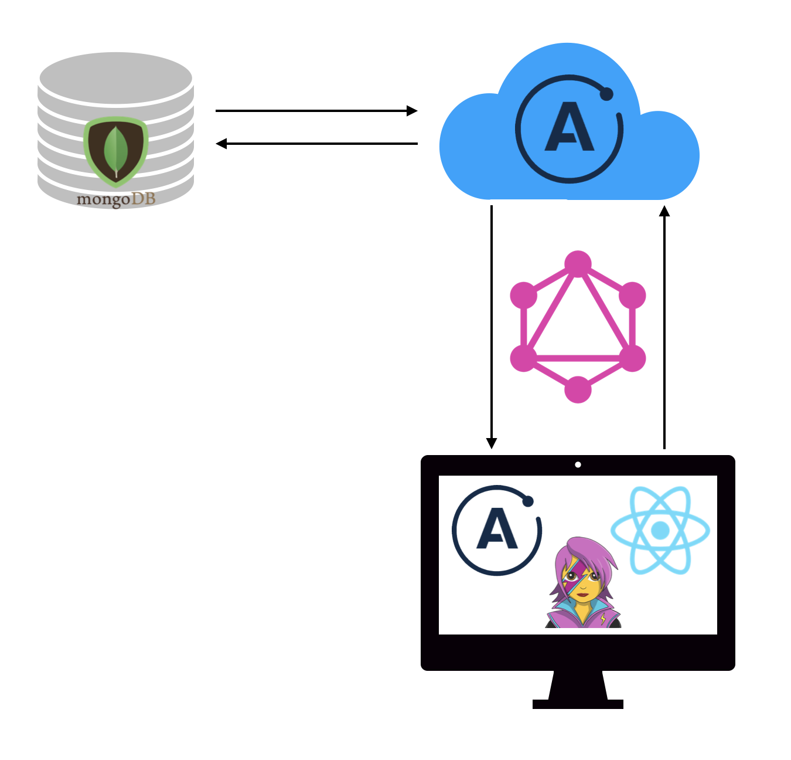

# Flock - Front end

[](https://opensource.org/licenses/mit-license.php)

## Introduction

Planning trips has never been easier before. Flock is the easiest way organizing trips as a group. Every member of a trip can make suggestions on three categories: Destination, Budget, Timeframe. Everyone can vote for their favorite option. As soon as the decision is made the creator can lock the voting. Any need to discuss? With the help of the chat feature communication is centralized in the app.


## Screenshots




## Installation

1. Clone the repo to your local machine

``` 
git clone https://github.com/bertacume/flock-client`
```
2. Install all dependencies
```
cd flock-client/thesis-fe
npm i
```
3. Start the app

```
npm start
```


## Tech stack


* <a href="https://graphql.org/">GraphQL</a>
* <a href="https://www.apollographql.com/docs/apollo-server/">Apollo Server</a>
* <a href="https://www.mongodb.com/what-is-mongodb">MongoDB</a>
* <a href="https://jestjs.io/">Jest</a>

## Authors
* Marco Kunz | <a href="https://www.linkedin.com/in/marcokunz/">linkedIn</a> | <a href="https://github.com/mrcknz">gitHub</a>
* Berta Cumellas | <a href="https://www.linkedin.com/in/berta-cumellas/">linkedIn</a> | <a href="https://github.com/bertacume">gitHub</a>
* Arturo Moreira Pintos dos Santos | <a href="https://www.linkedin.com/in/arturo-moreira-santos-381a21176/">linkedIn</a> | <a href="https://github.com/artyBMPS">gitHub</a>
* Damien Derail | <a href="https://www.linkedin.com/in/damien-derail-b446932a/">linkedIn</a> | <a href="https://github.com/Damien1208">gitHub</a>
* Christopher Buecklein | <a href="https://www.linkedin.com/in/christopher-b%C3%BCcklein-594b13b3/">linkedIn</a> | <a href="https://github.com/Bueggi">gitHub</a>

## Contribution
This project is licensed under MIT license. Feel free to fork the project and open a PR for any changes.
